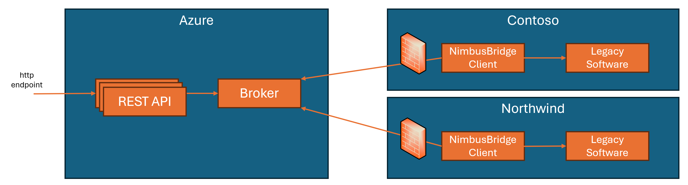

# NimbusBridge: Seamless integration of your legacy software with Azure Cloud

NimbusBridge is an architectural guidance that aim to simplify the integration of legacy software with the Azure Cloud. You can read more about this architecture guidance in this [blog post](TODO ISE DevBlog URL). 
This repository contains a reference implementation of the NimbusBridge architecture, using C# and .NET 8.

It simulates the following architecture / flow:

## Getting Started

### Local environment

Install the following prerequisites:

- [Azure CLI](https://aka.ms/azure-cli)
- [Azure Developer CLI](https://aka.ms/azure-dev/install)
- [.NET 8](https://dotnet.microsoft.com/download/dotnet/8.0)
- [Visual Studio Code](https://code.visualstudio.com/download) or [Visual Studio 2022](https://visualstudio.microsoft.com/downloads/)
- [Git](https://git-scm.com/downloads)
- [Powershell 7+ (pwsh)](https://github.com/powershell/powershell) - For Windows users only, optional if you use VS 2022, then Developer Command Prompt for VS2022 is enough.
- [Docker](https://www.docker.com/products/docker-desktop/)

   > **Important** 
   > Ensure Docker is running before running any `azd` provisioning / deployment commands.

Then, run the following commands to get the project on your local environment:

   1. Clone the repository
   2. Run `az login` to login to your Azure subscription
   3. Run `azd auth login`
   4. Run `azd env new <env-name>` where `<env-name>` is the name of your environment
   5. Run `azd up` to provision the environment and deploy the `NimbusBridgeApi` application

> **Note** 
> If you want to deploy only the infrastructure and not deploy the application, run `azd provision` instead of `azd up`.

#### Infrastucture

These are the main resources that are created when running the `azd up` command:

- A resource group
- An Azure Key Vault
- An Azure EventHubs namespace
- An Azure Storage account
- An Azure Container Registry
- An App Container Environment and App Container Service
- An Azure AppInsights instance

#### Projects structure

This sample is composed by the following projects:

- [NimbusBridge.Core](./src/NimbusBridge.Core) - Contains the core logic of the NimbusBridge architecture, interfaces of the different services and the models (commands and responses) used by API and client.
- [NimbusBridge.Azure.EventHubs](./src/NimbusBridge.Azure.EventHubs) - Contains the implementation of the NimbusBridge services using Azure EventHubs. These implementations are used by the API and the client.
- [NimbusBridgeApi](./src/NimbusBridgeApi) - Contains the API that exposes the NimbusBridge services in the Cloud.
- [NimbusBridge.Client](./src/NimbusBridge.Client) - Contains the client application that runs on premises and calls the legacy software.
- [NimbusBridge.LegacySdk](./src/NimbusBridge.LegacySdk) - Contains the SDK that simulates the legacy software.

> **Note** 
> If you are using Visual Studio 2022, you can open the [src/NimbusBridge.sln](./src/NimbusBridge.sln) solution file to open all the projects at once.

#### Run the NimbusBridge client application

Before running the NimbusBridge client application you need to update the [appsettings.json](./src/NimbusBridge.Client/appsettings.json) file with the following values:

- `NIMBUS_BRIDGE_CHECKPOINT_BLOB_CONTAINER_URL` - The URL of the EventHubs checkpointing storage container
- `NIMBUS_BRIDGE_EVENTHUBS_NAMESPACE_FQDN` - The fully qualified domain name of the EventHubs namespace

Both values can be found in the `.env` file that has been generated after the `azd up` command.

Then, run the following commands to run the client application:

   1. Run `cd src/NimbusBridge.Client`
   1. Run `dotnet run`

At startup, the NimbusBridge client will ask you to enter the name of the tenant you want to simulate. Accepted values are `contoso` and `northwind`. If you enter any other value, the client will default to `contoso`.

#### Call the Nimbus Bridge API

Now that both API and client are running, you can call the API to check that everything works correctly. The endpoint of the API is available at the end of the output of the `azd up` command. The only implemented API is `/weatherforecast?tenantId=<TENANT_ID>`, where `<TENANT_ID>` is either `contoso` or `northwind`, depending on what you have chosen when running the client application.

#### Clean up

To clean up the environment, run `azd down --purge`. It will remove the resource group and all the resources created by the `azd up` command, as well as completely purge the key vault so you can eventually re-deploy the environment.
